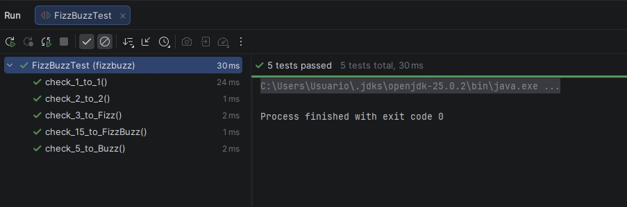

# 🧪 Kata FizzBuzz - TDD en Java

## 📌 Descripción

Este proyecto implementa la clásica Kata FizzBuzz aplicando la metodología **TDD (Test Driven Development)** en Java utilizando JUnit 5.

La función debe cumplir las siguientes reglas:

- Si el número es múltiplo de 3 → devolver "Fizz"
- Si el número es múltiplo de 5 → devolver "Buzz"
- Si el número es múltiplo de 3 y 5 → devolver "FizzBuzz"
- Si no cumple ninguna condición anterior → devolver el número como texto

---

# 📂 Estructura del Proyecto

```
FizzBuzzTDD/
│
├── pom.xml
├── screenshot-test.png
├── README.md
│
└── src/
    ├── main/java/
    │   ├── FizzBuzz.java
    │   └── Main.java
    │
    └── test/java/
        └── FizzBuzzTest.java
```

---

# ⚙️ Implementación

## Clase FizzBuzz

Contiene el método:

```java
public String convert(int number);
```

Este método aplica las reglas de negocio siguiendo el orden correcto:

1. Primero verifica múltiplos de 3 y 5.
2. Después múltiplos de 3.
3. Después múltiplos de 5.
4. Finalmente devuelve el número como String.

---

## Clase Main

Permite ejecutar la aplicación mostrando por consola los números del 1 al 15 transformados según las reglas.

Resultado esperado en consola:

```
1
2
Fizz
4
Buzz
Fizz
7
8
Fizz
Buzz
11
Fizz
13
14
FizzBuzz
```

---

# 🧪 Desarrollo de Tests (TDD Paso a Paso)

Se aplicó el ciclo de TDD:

1. 🔴 Escribir un test que falle
2. 🟢 Implementar el código mínimo para hacerlo pasar
3. 🔵 Refactorizar manteniendo los tests en verde
4. Repetir el proceso

## Orden de creación de los tests

### 1️⃣ check_1_to_1

Verifica que el número 1 devuelve "1".

```java
@Test
public void check_1_to_1() {
    assertEquals("1", new FizzBuzz().convert(1));
}
```

---

### 2️⃣ check_2_to_2

Verifica que el número 2 devuelve "2".

```java
@Test
public void check_2_to_2() {
    assertEquals("2", new FizzBuzz().convert(2));
}
```

---

### 3️⃣ check_3_to_Fizz

Verifica múltiplos de 3.

```java
@Test
public void check_3_to_Fizz() {
    assertEquals("Fizz", new FizzBuzz().convert(3));
}
```

---

### 4️⃣ check_5_to_Buzz

Verifica múltiplos de 5.

```java
@Test
public void check_5_to_Buzz() {
    assertEquals("Buzz", new FizzBuzz().convert(5));
}
```

---

### 5️⃣ check_15_to_FizzBuzz

Verifica múltiplos de 3 y 5.

```java
@Test
public void check_15_to_FizzBuzz() {
    assertEquals("FizzBuzz", new FizzBuzz().convert(15));
}
```

---

# 🧪 Sección Tests (Requerimiento del Profesor)

## Ejecución de los tests

Los tests se ejecutaron utilizando Maven con el siguiente comando:

```
mvn test
```

---

## Resultado de la ejecución

Todos los tests pasan correctamente ✔

Resumen esperado en consola:

- Tests run: 5
- Failures: 0
- Errors: 0
- BUILD SUCCESS

---

## 📸 Captura de pantalla

A continuación se muestra la captura de pantalla del resultado de los tests en verde:



> 📌 Nota: La imagen `captura-tests.png` debe estar ubicada en la raíz del proyecto.

(Agregar aquí la captura de pantalla después de ejecutar los tests)

---

# ✅ Criterios de Evaluación Cumplidos

- ✔ Función implementada correctamente
- ✔ Aplicación imprime los valores esperados
- ✔ Tests unitarios creados
- ✔ Tests pasan correctamente
- ✔ Metodología TDD aplicada paso a paso
- ✔ Evidencia visual incluida en el README

---

# 👨‍💻 Autor

Proyecto realizado como práctica de Testing TDD en Java.